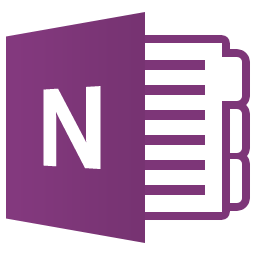

# What have i done these days
## The first: download some necessary programes
#### Example:
<table>
  <tr>
    <td>Logo</td><td>Name</td><td>Related links</td>
  </tr>
  <tr>
    <td></img></td>
    <td>Visual Studio 2017</td>
    <td>Please click the <a href="https://www.visualstudio.com/downloads">Download</a></td>
  </tr>
  <tr>
    <td></img></td>
    <td>VS Code</td>
    <td>Please click the <a href="https://www.visualstudio.com/downloads">Download</td>
  </tr>
  <tr>
    <td></img></td>
    <td>OneNote</td>
    <td>Please click the <a href="https://www.OneNote.com/downloads">Download</td>
  </tr>
  <tr>
    <td></img></td>
    <td>Outlook</td>
    <td>Please click the <a href="https://www.Outlook.com/downloads">Download</td>
  </tr>
  <tr>
    <td></img></td>
    <td>Microsoft Teams</td>
    <td>Please click the <a href="https://www.microsoft teams.com/downloads">Download</td>
  </tr>
</table>

## The second: learned and used the GitHub through OPS and Decs

* ### Go to [GitHub](https://github.com/).Creating the GitHub account.

* ### Update code and send pull request

* ### Send pull request in GitHub

* ### Go to [OPS portal](https://ops.microsoft.com/).Docset config in repo and OPS

* ### Build repo in local machine

* ### Clone a repo to local
