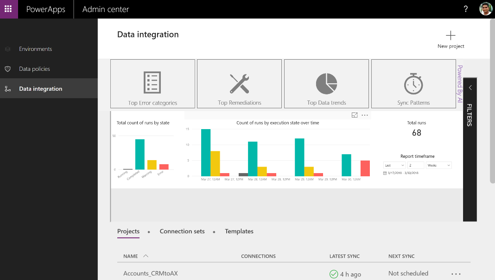
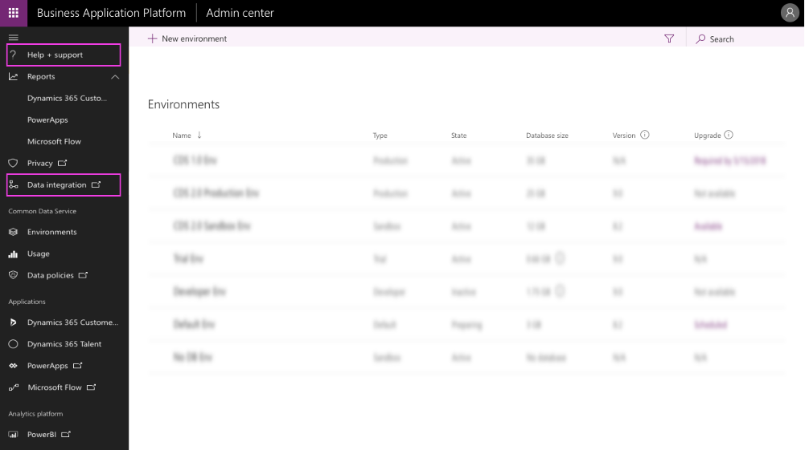
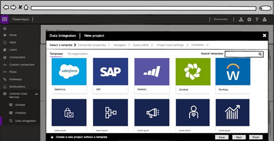
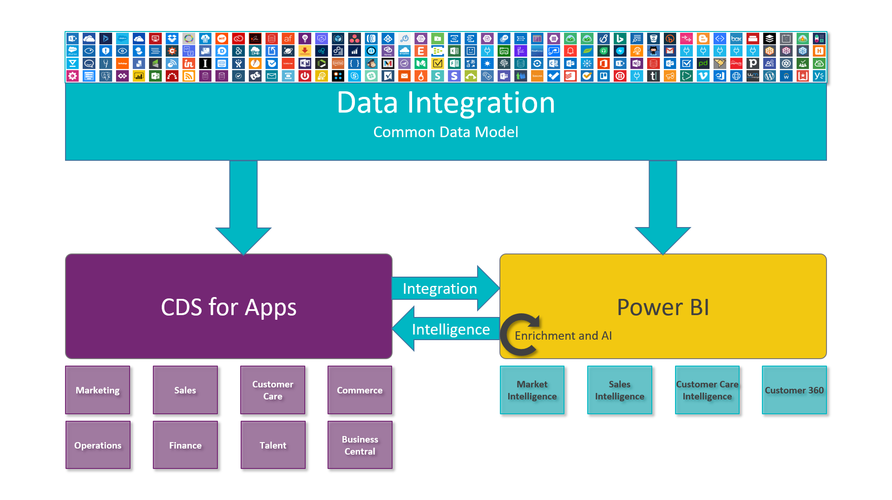

---

title: Enhanced administrator capabilities for- Data Integration
description: Enhanced administrator capabilities for Data Integration
author: MargoC
manager: AnnBe
ms.date: 7/22/2018
ms.assetid: c3affd82-9c58-4cbd-bcdb-49b594752397
ms.topic: article
ms.prod: 
ms.service: business-applications
ms.technology: 
ms.author: margoc
audience: Admin

---
#  Enhanced administrator capabilities for Data Integration

[Download the October '18 Release Notes PDF](https://go.microsoft.com/fwlink/p/?linkid=2005971)

Top asks from our customers in the October ’18 release.

   ## General Data Protection Regulation (GDPR) and Accessibility General
   
   GDPR requirements are among the top company
   priorities this season. The data integrator for admins meets GDPR requirements
   that enable access and delete and other GDPR-granted data subject rights.
   Additionally, the data integrator for admins is also compliant with Grade-C
   accessibility requirements.

   ## Improving ability to customize and version templates 
   
   We understand every business is different. Since the release of the data integrator for
   admins, the majority of our customers have leveraged the ability to customize
   templates for process-based integration, making it a highly used feature. In
   the past, customers had to always start from an existing template and tweak
   it to create a new template. We have further enhanced this experience by
   providing a way to create new templates from scratch and provide an ability
   to version templates and validate source and destination solutions.

   ## A richer data integrator admin dashboard powered by AI
   
   Earlier this year, Microsoft released an admin dashboard that provides a one-stop,
   real-time view of all project executions and their status with a drill-down
   to view details of executions. The enhanced dashboard now provides richer
   statistics, such as categorization of errors, remediation for frequent
   errors, intelligently suggesting data refresh intervals, data trend analysis
   and sync patterns. All this out of the box, without writing code.

   
   <!-- picture -->

   ## Improved data integration setup and administration experience with performance improvements
   
   By centralizing all experiences in the new Business Platform Admin Center, 
   the data integrator for admins provides an improved setup experience wherein 
   customers no longer need to switch between multiple portals. This includes 
   a new ability to create data integration support tickets, in-place from the 
   same portal. The project execution history will provide the full history over 
   past executions. The data import performance will be improved with new automatic 
   mechanisms for batching and data parallelism underneath.

   
   <!-- picture -->

   ## Ability to share data integration templates within and across tenants 
   
   Data Integration Templates accelerate getting data to the Common Data Service from common 
   third-party systems of records and SaaS services. 
   For example, the **Salesforce template** helps customers integrate their
   Salesforce data into CDS and gain insights into their opportunities and
   sales pipeline easily. In addition to Microsoft providing additional data
   integration templates out of the box, customers and ISVs can leverage the
   underlying platform to simply build their own new templates and share them
   across CDS instances, as well as customize existing templates to adapt them
   to their needs and repackage them as new templates for reuse.

   
   <!-- picture -->

   Consultants can customize templates, as well as repackage and reuse them
   across CDS instances without having to repeat the process. Collaboration and
   distribution in larger enterprise organizations are supported through sharing
   templates with specific set users or groups.

   With the help of Common Data Service for Apps role-based access, business
   users and admins will be able to assign fine-grained permissions that allow users
   within their organization to either read, contribute to, or own templates. This
   capability is also extended to data integration projects, as large
   enterprise organizations often need to structure who can contribute to
   projects and who can read/use. Multiple users can share projects and
   templates with permissions defined for their role.

   

   Templates will also become easily discoverable in a central marketplace.
   Customers will be able to create a data integration project by easily browsing the
   marketplace and obtain the latest templates. Additionally, customers and
   partners will be able to create custom templates and publish them to the marketplace.
   Templates could also be shared across tenants with the ability to control
   viewership.

   

   > 

## Image in alert
> [!NOTE] 
>  Text before Image 
> 30.jpg "This is title")
>  Text after Image

We’ve done this work to help you—our partners, customers, and users—drive the digital transformation of your business on your terms.

We’re looking forward to engaging with you as you put these new services and capabilities to work, and we’re eager to hear your feedback as you dig into the October ’18 release.

Let us know your thoughts. Send email to <a href="mailto:releasenotes@microsoft.com">releasenotes@microsoft.com</a>. We’ll use your feedback to improve our content.
   <!-- picture -->